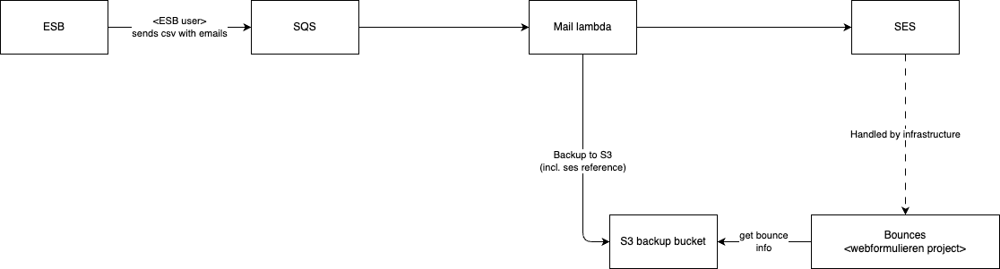

# ESF mail opzet

## Flow




## Message format
Voorbeeld van een bericht dat de ESB op de queue plaats op basis waarvan de mail lambda mails kan sturen.

```json
{
  "metadata": {
    "correlationId": "",
  },
  "data": [
    {
      "e-mailadres": "",
      "inleverdatum": "",
      "draaidatum": "",
      "klantnummer": "",
    }
  ],
}
```